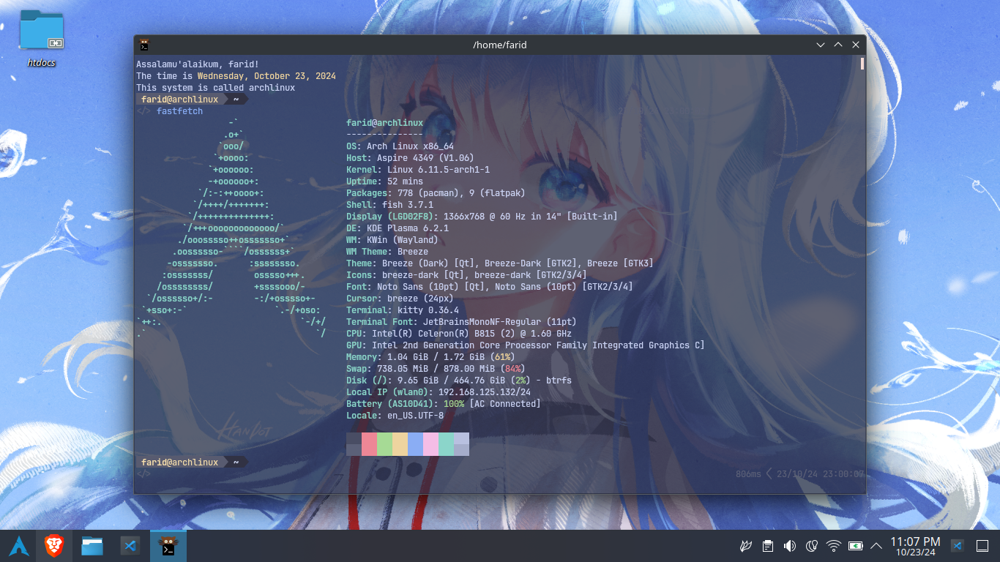

# FARIDREAMING'S Dotfiles



## Contents

- `fish/`: Fish shell configuration.
- `gitconfig/`: Git configuration.
- `kitty/`: Kitty terminal configuration.
- `nvim/`: Neovim configuration.

## Installation Instructions

To install these dotfiles, follow the steps below:

**1. Clone this repository:**

```bash
git clone https://github.com/faridreaming/dotfiles.git ~/dotfiles
cd ~/dotfiles

```

**2. Install packages**

```bash
sh packages-setup.sh
```

**3. Install Yay**

```bash
sh yay-setup.sh
```

**4. Setup the rest**

```bash
sh terminal-setup.sh
sh neovim-setup.sh
```
