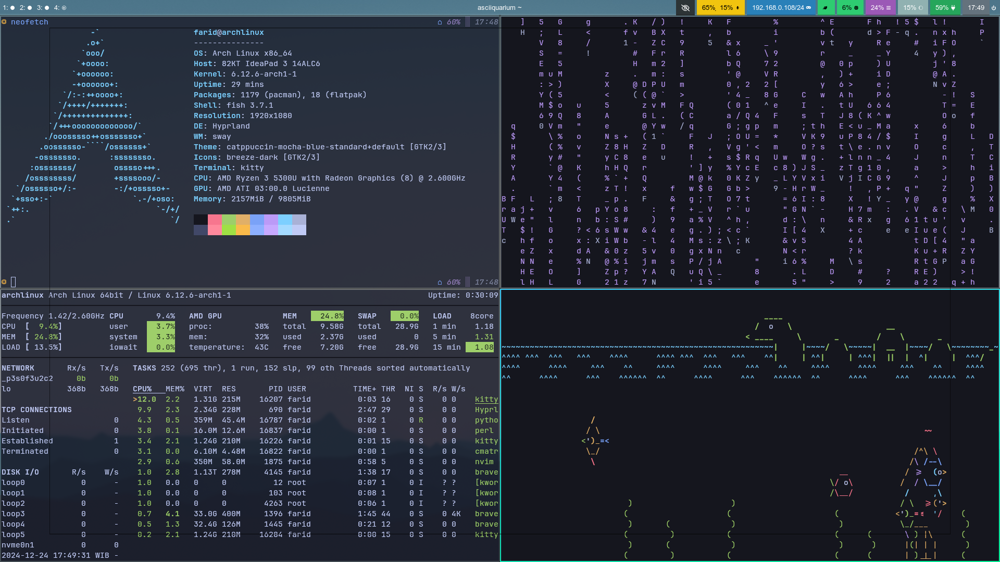

# Faridreaming's Dotfiles



## Install `yay` (Prerequisite)

To install `yay` (AUR helper), run the following commands:

```bash
sudo pacman -S --needed base-devel git
git clone https://aur.archlinux.org/yay.git
cd yay
makepkg -si
```

## Dependencies

Ensure the following dependencies are installed:

1. Neovim\
   Packages: `neovim xclip`

2. Fish\
    Packages: `fish  starship`\
    AUR: `ttf-jetbrains-mono-nerd`\
   Commands:

   ```bash
   chsh -s /usr/bin/fish
   starship preset jetpack -o ~/.config/starship.toml
   ```

3. Kitty\
   Packages: `kitty`

4. Fastfetch\
   Packages: `fastfetch`

5. Vim\
   Packages: `vim`

6. Hyprland\
   Packages: `hyprland hypridle hyprlock hyprpaper swaync waybar`
